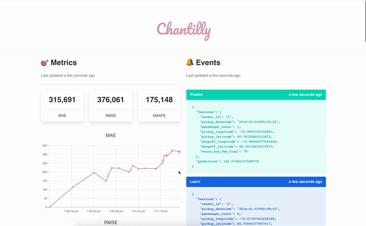

<p align="center">
  
</p>

<p align="center">
  <!-- Travis -->
  <a href="https://travis-ci.org/creme-ml/chantilly">
    
  </a>
  <!-- Codecov -->
  <a href="https://codecov.io/gh/creme-ml/chantilly">
    
  </a>
  <!-- Gitter -->
  <a href="https://gitter.im/creme-ml/community?utm_source=share-link&utm_medium=link&utm_campaign=share-link">
    
  </a>
  <!-- PyPI -->
  <!-- <a href="https://pypi.org/project/chantilly">
    
  </a> -->
  <!-- License -->
  <a href="https://opensource.org/licenses/BSD-3-Clause">
    
  </a>
</p>

<p align="center">
  <code>chantilly</code> is a deployment tool for <a href="https://www.wikiwand.com/en/Online_machine_learning">online machine learning</a> models. It is designed to work hand in hand with <a href="https://github.com/creme-ml/creme"><code>creme</code></a>.
</p>

## Table of contents

- [Table of contents](#table-of-contents)
- [Introduction](#introduction)
- [Installation](#installation)
- [User guide](#user-guide)
  - [Running the server](#running-the-server)
  - [Picking a flavor](#picking-a-flavor)
  - [Uploading a model](#uploading-a-model)
  - [Making a prediction](#making-a-prediction)
  - [Updating the model](#updating-the-model)
  - [Monitoring metrics](#monitoring-metrics)
  - [Monitoring events](#monitoring-events)
  - [Visual monitoring](#visual-monitoring)
  - [Usage statistics](#usage-statistics)
  - [Using multiple models](#using-multiple-models)
  - [Configuration handling](#configuration-handling)
  - [Importing libraries](#importing-libraries)
  - [Deployment](#deployment)
- [Examples](#examples)
- [Development](#development)
- [Roadmap](#roadmap)
- [Technical stack](#technical-stack)
- [Similar alternatives](#similar-alternatives)
- [License](#license)

## Introduction

There are many tools for deploying machine learning models. However, none of them support **online models that can learn on the fly**, but `chantilly` does.

Here are some advantages:

- **Simple**: `chantilly` is essentially just a Flask app.
- **Straightforward**: you provide a model, `chantilly` provides a few API routes to do the rest.
- **Convenient**: `chantilly` rids you of the burden of storing features between prediction and learning steps.
- **Flexible**: use any model you wish, as long as it's written in Python and implements a couple of required methods.

Note that `chantilly` is very young, and is therefore subject to evolve. We're also eager for feedback and are happy to work hand in hand with you if you have specific needs.

## Installation

`creme` is intended to work with **Python 3.7 or above**. Installation can be done by using `pip`:

```sh
> pip install git+https://github.com/creme-ml/chantilly
```

## User guide

### Running the server

Once you've followed the installation step, you'll get access to the `chantilly` CLI. You can see the available commands by running `chantilly --help`. You can start a server with the `run` command:

```sh
> chantilly run
```

This will start a [Flask](https://flask.palletsprojects.com/en/1.0.x/) server with all the necessary routes for uploading a model, training it, making predictions with it, and monitoring it. By default, the server will be accessible at [`localhost:5000`](http://localhost:5000), which is what we will be using in the rest of the examples in the user guide. You can run `chantilly routes` in order to see all the available routes.

### Picking a flavor

The first thing you need to do is pick a flavor. Currently, the available flavors are:

- `regression` for regression tasks.
- `binary` for binary classification tasks.
- `multiclass` for multi-class classification tasks.

You can set the flavor by sending a POST request to `@/api/init`, as so:

```py
import requests

config = {'flavor': 'regression'}
requests.post('http://localhost:5000/api/init', json=config)
```

You can also set the flavor via the CLI:

```py
> chantilly init regression
```

:warning: Setting the flavor will erase everything and thus provide a clean slate.

You can view the current flavor by sending a GET request to `@/api/init`:

```py
r = requests.get('http://localhost:5000/api/init')
print(r.json()['flavor'])
```

### Uploading a model

You can upload a model by sending a POST request to the `@/api/model` route. You need to provide a model which has been serialized with [`pickle`](https://docs.python.org/3/library/pickle.html) or [`dill`](https://dill.readthedocs.io/en/latest/dill.html) (we recommend the latter). For example:

```py
from creme import compose
from creme import linear_model
from creme import preprocessing
import dill
import requests

model = compose.Pipeline(
    preprocessing.StandardScaler(),
    linear_model.LinearRegression()
)

requests.post('http://localhost:5000/api/model', data=dill.dumps(model))
```

Likewise, the model can be retrieved by sending a GET request to `@/api/model`:

```py
r = requests.get('http://localhost:5000/api/model')
model = pickle.loads(r.content)
```

Note that `chantilly` will validate the model you provide to make sure it works with the flavor you picked. For instance, if you picked the `regression` flavor, then the model has to implement `fit_one` and `predict_one`.

You can also add a upload by using the CLI. First, you need to serialize a model and dump it to a file:

```py
with open('model.pkl', 'wb') as file:
    dill.dump(model, file)
```

Then, call the `add-model` sub-command:

```sh
> chantilly add-model model.pkl
```

### Making a prediction

Predictions can be obtained by sending a POST request to `@/api/predict`. The payload you send has to contain a field named `features`. The value of this field will be passed to the `predict_one` method of the model you uploaded earlier on. If the model you provided `predict_proba_one` then that will be used instead. Here is an example:

```py
import requests

r = requests.post('http://localhost:5000/api/predict', json={
    'id': 42,
    'features': {
        'shop': 'Ikea',
        'item': 'Dombäs',
        'date': '2020-03-22T10:42:29Z'
    }
})

print(r.json()['prediction'])
```

Note that in the previous snippet we've also provided an `id` field. This field is optional. If is is provided, then the features will be stored by the `chantilly` server, along with the prediction. This allows not having to provide the features again when you want to update the model later on.

### Updating the model

The model can be updated by sending a POST request to `@/api/learn`. If you've provided an ID in an earlier call to `@/api/predict`, then you only have to provide said ID along with the ground truth:

```py
import requests

requests.post('http://localhost:5000/api/learn', json={
    'id': 42,
    'ground_truth': 10.21
})
```

However, if you haven't passed an ID earlier on, then you have to provide the features yourself:

```py
requests.post('http://localhost:5000/api/learn', json={
    'features': {
        'shop': 'Ikea',
        'item': 'Dombäs',
        'date': '2020-03-22T10:42:29Z'
    },
    'ground_truth': 10.21
})
```

Note that the `id` field will have precedence in case both of `id` and `features` are provided. We highly recommend you to use the `id` field. First of all it means that you don't have to take care of storing the features between calls to `@/api/predict` and `@/api/learn`. Secondly it makes the metrics more reliable because they will be using the predictions that were made at the time `@/api/predict` was called.

### Monitoring metrics

You can access the current metrics via a GET request to the `@/api/metrics` route.

Additionally, you can access a stream of metric updates by using the `@/api/stream/metrics`. This is a streaming route which implements [server-sent events (SSE)](https://www.wikiwand.com/en/Server-sent_events). As such it will notify listeners every time the metrics are updates. For instance, you can use the [`sseclient`](https://github.com/btubbs/sseclient) library to monitor the metrics from a Python script:

```py
import json
import sseclient

messages = sseclient.SSEClient('http://localhost:5000/api/stream/metrics')

for msg in messages:
    metrics = json.loads(msg.data)
    print(metrics)
```

You can use the following piece of JavaScript to do the same thing in a browser:

```js
var es = new EventSource('http://localhost:5000/api/stream/metrics');
es.onmessage = e => {
    var metrics = JSON.parse(e.data);
    console.log(metrics)
};
```

### Monitoring events

You can also listen to all the prediction and learning events via the `@/api/stream/events` route. This will yield SSE events with an event name attached, which is either 'predict' or 'learn'. From a Python interpreter, you can do the following:

```py
import json
import sseclient

messages = sseclient.SSEClient('http://localhost:5000/api/stream/events')

for msg in messages:
    data = json.loads(msg.data)
    if msg.event == 'learn':
        print(data['model'], data['features'], data['prediction'], data['ground_truth'])
    else:
        print(data['model'], data['features'], data['prediction'])
```

In JavaScript, you can you use the [`addEventListener`](https://developer.mozilla.org/en-US/docs/Web/API/EventTarget/addEventListener) method:

```js
var es = new EventSource('http://localhost:5000/api/stream/events');

es.addEventListener('learn', = e => {
    var data = JSON.parse(e.data);
    console.log(data.model, data.features, data.prediction, data.ground_truth)
};

es.addEventListener('predict', = e => {
    var data = JSON.parse(e.data);
    console.log(data.model, data.features, data.prediction)
};
```

### Visual monitoring

A live dashboard is accessible if you navigate to [`localhost:5000`](http://localhost:5000) in your browser.

<p align="center">
  
</p>

Under the hood the dashboard is simply listening to the API's streaming routes.

### Usage statistics

You can obtain some essential statistics, by querying the `@/api/stats` routes:

```py
import requests

r = requests.get('http://localhost:5000/api/stats')
print(r.json())
```

Here is an output example:

```json
{

    "learn": {
        "ewm_duration": 3408682,
        "ewm_duration_human": "3ms408μs682ns",
        "mean_duration": 6541916,
        "mean_duration_human": "6ms541μs916ns",
        "n_calls": 98
    },
    "predict": {
        "ewm_duration": 3190724,
        "ewm_duration_human": "3ms190μs724ns",
        "mean_duration": 5248635,
        "mean_duration_human": "5ms248μs635ns",
        "n_calls": 213
    }

}
```

The `mean_duration` fields contain the average duration of each endpoint. The `ewm_duration` fields contain an [exponential moving average](https://www.wikiwand.com/en/Moving_average#/Exponential_moving_average) of said duration, and therefore gives you an idea of the recent performance, which can allow you to detect arising performance issues. Note that these durations do not include the time it takes to transmit the response over the network. These durations only pertain to the processing time on `chantilly`'s side, including but not limited to calls to the model. 

These statistic are voluntarily very plain. Their only purpose is to provide a quick healthcheck. The proper way to monitor a web application's performance, including a Flask app, is to use purpose-built tools. For instance you could use [Loki](https://github.com/grafana/loki) to monitor the application logs and [Grafana](https://grafana.com/) to visualize and analyze them.

### Using multiple models

You can use different models by giving them names. You can provide a name to a model by adding a suffix to `@/api/model`:

```py
from creme import tree
import dill
import requests

model = tree.DecisionTreeClassifier()

requests.post('http://localhost:5000/api/model/barney-stinson', data=dill.dumps(model))
```

You can also pick a name when you add the model through the CLI:

```sh
> chantilly add-model model.pkl --name barney-stinson
```

You can then choose which model to use when you make a prediction:

```py
r = requests.post('http://localhost:5000/api/predict', json={
    'id': 42,
    'features': {
        'shop': 'Ikea',
        'item': 'Dombäs',
        'date': '2020-03-22T10:42:29Z'
    },
    'model': 'barney-stinson'
})
```

The model which was provided last will be used by default if the `model` field is not specified. If you provide an `id`, then the model which was used for making the prediction will be the one that is updated once the ground truth is made available. You can also specify which model to update directly as so:

```py
requests.post('http://localhost:5000/api/learn', json={
    'id': 42,
    'ground_truth': 10.21,
    'model': 'barney-stinson'
})
```

Note that the data associated with the given `id` is deleted once the model has been updated. In other words you can't call the `@/api/model` with the same `id` twice.

You can view the available models as well as the default model by sending a GET request to `@/api/models`:

```py
r = requests.get('http://localhost:5000/api/models')
print(r.json())
```

You can delete a model by sending a DELETE request to `@/api/model`:

```py
requests.delete('http://localhost:5000/api/model/barney-stinson')
```

### Configuration handling

`chantilly` follows Flask's [instance folder](https://flask.palletsprojects.com/en/1.1.x/config/#instance-folders) pattern. This means that you can configure `chantilly` via a file named `instance/config.py`. Note that the location is relative to where you are launching the `chantilly run` command from. You can set all the [builtin variables](https://flask.palletsprojects.com/en/1.1.x/config/#builtin-configuration-values) that Flask provides. You can also set the following variables which are specific to `chantilly`:

- `SHELVE_PATH`: location of the [shelve](https://docs.python.org/3/library/shelve.html) database file.

The `instance/config.py` is a Python file that gets executed before the app starts, therefore this is also where you can [configure logging](https://flask.palletsprojects.com/en/1.1.x/logging/).

Here is an example `instance/config.py` file:

```py
from logging.config import dictConfig

dictConfig({
    'version': 1,
    'formatters': {'default': {
        'format': '[%(asctime)s] %(levelname)s in %(module)s: %(message)s',
    }},
    'handlers': {'wsgi': {
        'class': 'logging.FileHandler',
        'filename': '/var/log/chantilly/error.log',
        'formatter': 'default'
    }},
    'root': {
        'level': 'INFO',
        'handlers': ['wsgi']
    }
})

SECRET_KEY = 'keep_it_secret_keep_it_safe'
SHELVE_PATH = '/usr/local/chantilly'
```

### Importing libraries

It's highly likely that your model will be using external dependencies. A prime example is the [`datetime`](https://docs.python.org/3/library/datetime.html) module, which you'll probably want to use to parse datetime strings. Instead of specifying which libraries you want `chantilly` to import, the current practice is to import your requirements *within* your model. For instance, here is an excerpt taken from the [New-York city taxi trips example](examples/taxis):

```py
from creme import compose
from creme import linear_model
from creme import preprocessing

def parse(trip):
    import datetime as dt
    trip['pickup_datetime'] = dt.datetime.fromisoformat(trip['pickup_datetime'])
    return trip

def datetime_info(trip):
    import calendar
    day_no = trip['pickup_datetime'].weekday()
    return {
        'hour': trip['pickup_datetime'].hour,
        **{day: i == day_no for i, day in enumerate(calendar.day_name)}
    }

model = compose.FuncTransformer(parse)
model |= compose.FuncTransformer(datetime_info)
model |= preprocessing.StandardScaler()
model |= linear_model.LinearRegression()
```

Note that you need to make sure that the Python interpreter you're running `chantilly` with has access to the libraries you want to use.

### Deployment

Essentially, `chantilly` is just a Flask application. Therefore, it allows the same [deployment options](https://flask.palletsprojects.com/en/1.1.x/deploying/) as any other Flask application.

## Examples

- [New-York city taxi trips 🚕](examples/taxis)

## Development

```sh
> git clone https://github.com/creme-ml/chantilly
> cd chantilly
> pip install -e ".[dev]"
> python setup.py develop
> make test
> export FLASK_ENV=development
> chantilly run
```

## Roadmap

- **HTTP long polling**: Currently, clients can interact with `creme` over a straightforward HTTP protocol. Therefore the speed bottleneck comes from the web requests, not from the machine learning. We would like to provide a way to interact with `chantilly` via long-polling. This means that a single connection can be used to process multiple predictions and model updates, which reduces the overall latency.
- **Scaling**: At the moment `chantilly` is designed to be run as a single server. Ideally we want to allow `chantilly` in a multi-server environment. Predictions are simple to scale because the model can be used concurrently. However, updating the model concurrently leads to [reader-write problems](https://www.wikiwand.com/en/Readers%E2%80%93writers_problem). We have some ideas in the pipe, but this is going to need some careful thinking.
- **Grafana dashboard**: The current dashboard is a quick-and-dirty proof of concept. In the long term, we would like to provide a straighforward way to connect with a [Grafana](https://grafana.com/) instance without having to get your hands dirty. Ideally, we would like to use SQLite as a data source for simplicity reasons. However, The Grafana team [has not planned](https://github.com/grafana/grafana/issues/1542#issuecomment-425684417) to add support for SQLite. Instead, they encourage users to use [plugins](https://grafana.com/docs/grafana/latest/plugins/developing/datasources/). We might also look into [Prometheus](https://prometheus.io/) and [InfluxDB](https://www.influxdata.com/).
- **Support more paradigms**: For the moment we cater to regression and classification models. In the future we also want to support other paradigms, such as time series forecasting and recommender systems.

## Technical stack

- [Flask](https://flask.palletsprojects.com/en/1.1.x/) for the web server.
- [dill](https://dill.readthedocs.io/en/latest/dill.html) for model serialization.
- [marshmallow](https://marshmallow.readthedocs.io/en/stable/) for the API input validation.
- [Vue.js](https://vuejs.org/), [Chart.js](https://www.chartjs.org/), and [Moment.js](https://momentjs.com/) for the web interface.

## Similar alternatives

Most machine learning deployment tools only support making predictions with a trained model. They don't cater to online models which can be updated on the fly. Nonetheless, some of them are quite interesting and are very much worth looking into!

- [Cortex](https://github.com/cortexlabs/cortex)
- [Clipper](https://github.com/ucbrise/clipper)

## License

`creme` is free and open-source software licensed under the [3-clause BSD license](https://github.com/creme-ml/creme/blob/master/LICENSE).
